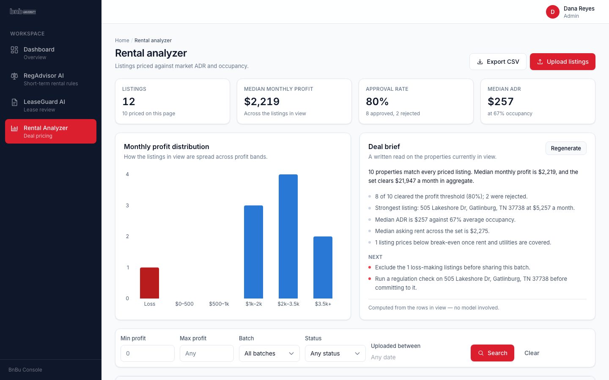
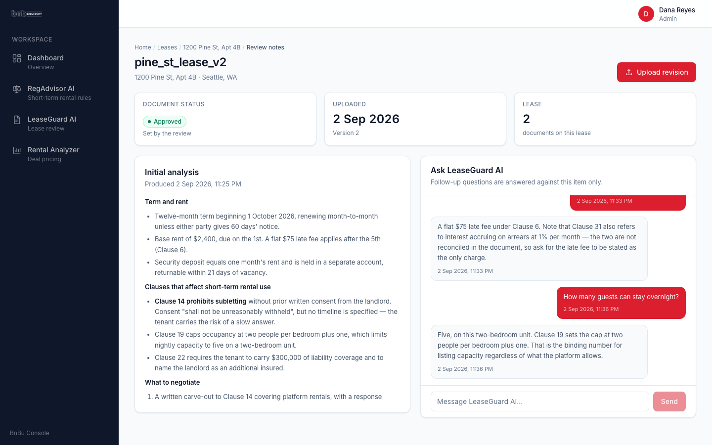
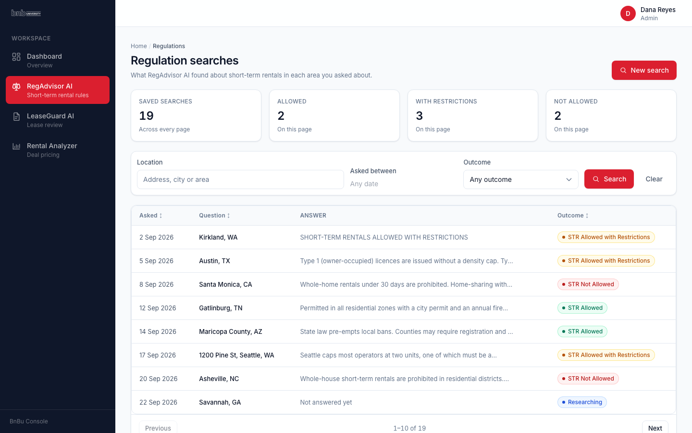
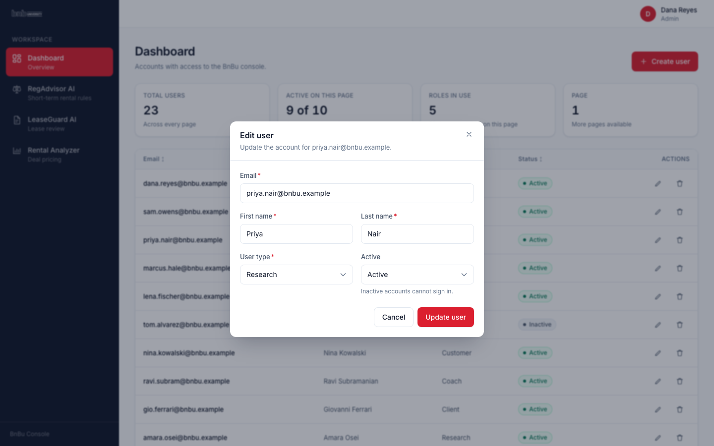
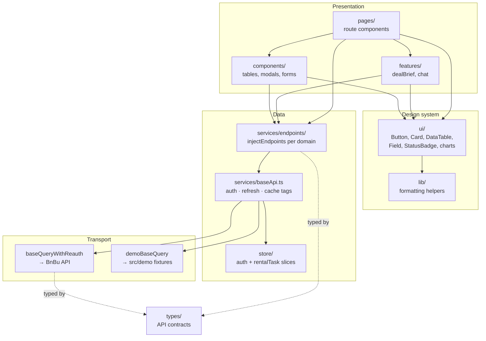
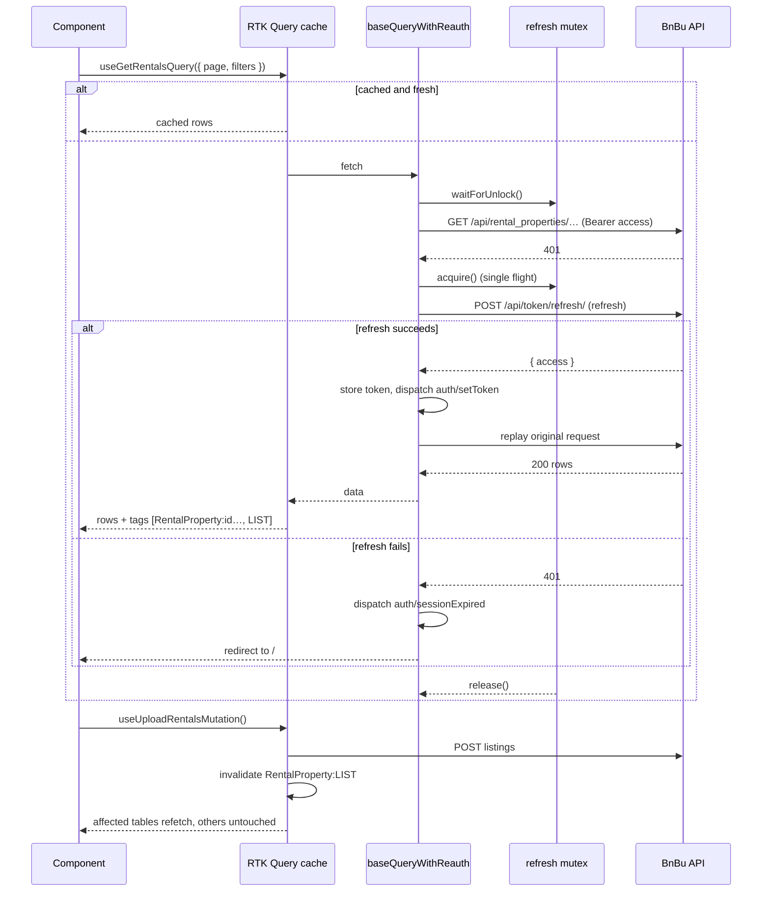

# BnBu Console

A web console for short-term-rental investors. You upload a spreadsheet of candidate
listings and the backend prices each one against market ADR and occupancy; you upload
lease PDFs and an AI review reads them for clauses that affect nightly letting; and you
ask whether a given city allows short-term rentals at all and keep the answers.

It is a browser-only client. Every figure and every AI analysis comes from
[the BnBu API](../bnbu_backend_api) — nothing is computed on the server here. The one
exception is the Deal Brief, described under [Design notes](#design-notes).

## Screenshots

Captured from the Docker image running in demo mode, so the data behind them is the
seeded fixture set rather than a snapshot of somebody's database.

**Rental analyzer** — listings priced against market, with the profit distribution and a
generated Deal Brief.



**Lease review** — the AI's initial analysis of an uploaded lease, and a follow-up
conversation scoped to that document.



**Regulation searches** — saved "can I run an STR here?" questions and their outcomes.



**Admin** — the user table with the edit dialog open.



## Architecture

The pattern is **feature-sliced presentation over a single typed data layer**. Components
never call `fetch`. They call a generated RTK Query hook; that hook's endpoint is declared
in `services/endpoints/`; every endpoint shares one base query that owns authentication,
token refresh and cache invalidation. Dependencies point inward: `pages` → `features` and
`components` → `ui` and `lib`, with `services` underneath and `types` at the bottom.



Two transports sit behind the same endpoint definitions. `VITE_DEMO_MODE=true` swaps
`baseQuery` for one that answers from `src/demo/fixtures.ts`; the endpoints, the cache
tags and every component above them are byte-identical either way. That is what makes the
screenshots above reproducible without a backend.

## How a request flows

The interesting path is an authenticated query whose access token has expired, because it
is where the data layer earns its keep.



Concurrent 401s wait on the mutex rather than each starting their own refresh, so a
dashboard firing six queries at once rotates the refresh token once, not six times.

## Quickstart

One command, no backend, no manual steps:

```bash
docker compose up --build       # http://localhost:8140
```

That builds the app with `VITE_DEMO_MODE=true` and serves the static bundle from
nginx. The console comes up populated with the seeded fixture set — users, priced
listings, lease reviews and regulation searches — so it is not eight empty tables on
first boot. Sign in with any email and the password `demo`; the demo transport accepts
anything and the login screen says so.

To run it against a real API instead:

```bash
VITE_DEMO_MODE=false VITE_API_URL=http://host.docker.internal:8000/ \
  docker compose up --build
```

Vite inlines `VITE_*` values at build time, so these are **build args**, not runtime
environment variables — a built image is pinned to whatever it was built with.

## Configuration

| Variable | Required | Default | What it does |
| --- | --- | --- | --- |
| `VITE_API_URL` | No | `http://localhost:8000/` | Base URL of the BnBu API. Must end in `/`. Unset logs a warning and uses the default, rather than resolving against the page origin and 404ing silently. |
| `VITE_DEMO_MODE` | No | `false` (`true` in Compose) | `'true'` answers every request from `src/demo/fixtures.ts` instead of the network. No backend needed. |
| `VITE_AI_PROXY_URL` | No | unset | URL of a server-side proxy that talks to a language model for the Deal Brief. Unset means the brief falls back to its computed provider. |
| `VITE_AI_MODEL` | No | unset | Model name passed through to that proxy. |
| `VITE_ENV` | No | unset | Label only; nothing in `src/` branches on it. |

**Never put an API key in a `VITE_*` variable.** Vite inlines them into the shipped
bundle, where anyone can read them. `VITE_AI_PROXY_URL` points at a service that holds
the key server-side; that is the whole reason the Deal Brief is proxied rather than
calling a vendor directly.

## Development

```bash
npm install
npm run dev            # http://localhost:5173, expects the API on :8000
VITE_DEMO_MODE=true npm run dev   # …or no API at all

npm test               # vitest run — 22 files, 180 tests
npm run typecheck      # tsc --noEmit
npm run lint           # eslint, --max-warnings 0
npm run build          # tsc && vite build
```

Screenshots are regenerated from the running container, so they never drift from the
committed UI:

```bash
docker compose up -d --build
npm run screenshots    # writes docs/screenshots/*.png at 1440x900
docker compose down -v
```

No test makes a network call or a paid API call. The Deal Brief's model provider is
exercised against a stubbed `fetch`.

## Project structure

```
src/
├── ui/                  Design system. The only place that knows what the product
│   │                    looks like: spacing, palette, focus rings, states.
│   ├── DataTable.tsx    Sorting, empty/loading/error states, virtualises past 150 rows
│   ├── Field.tsx        Label + control + error + description, one accessible unit
│   ├── StatusBadge.tsx  Renders any status via statusRegistry
│   ├── statusRegistry.ts  Status vocabularies — add a status, not a switch
│   └── charts/          Recharts wrappers sharing one theme
├── lib/format.ts        Currency, dates, occupancy, markdown-free previews
├── features/
│   ├── dealBrief/       The AI feature: stats, provider registry, panel
│   │   └── providers/   heuristic (always available) + model (needs a proxy)
│   └── chat/            The shared conversation UI, used by leases and regulations
├── services/
│   ├── baseApi.ts       One RTK Query instance: auth, refresh mutex, cache tags
│   ├── endpoints/       One file per domain, attached via injectEndpoints
│   ├── mutex.ts         Single-flight primitive for token refresh
│   └── queryString.ts   Builds filter params without empty keys
├── store/               Redux store; auth + rentalTask slices
├── hooks/               useChatHistoryPolling (backoff), useDocumentVisible
├── types/               API request/response contracts
├── demo/                Fixtures and a base query that serves them
├── pages/               Route components, all lazy except Login
└── components/          Domain components composed from ui/
```

## Design notes

**Why RTK Query owns invalidation.** Three booleans lived on the auth slice —
`refreshDocuments`, `refreshRegulations`, `refreshRentals` — and pages watched them to
call `refetch()` by hand. That refetched everything any mounted page was subscribed to,
whether or not the mutation had touched it, and it needed `keepUnusedDataFor: 0` on most
queries to behave at all, which disabled the cache outright. Those are now nine cache
tags. A mutation invalidates the tag it actually affects; unrelated tables are left
alone; and the cache holds for 60 seconds, so paging back and forth is instant.

**The bottleneck was the bundle, not the backend.** The app shipped as one 1,151 kB
JavaScript chunk plus 2.8 MB of PNGs — a 2.59 MB decorative image among them — on every
first load, before the user had seen anything. Three things fixed it:

- Route-level `lazy()` on every signed-in page, so the first load is the login screen
  and the shell.
- `manualChunks` splitting the vendor half, which is the larger and almost never
  changes. `react/jsx-runtime` has to be named explicitly in the React group: without
  it Rollup let the markdown chunk absorb it, the entry chunk then imported `jsx` from
  there, and the 118 kB markdown renderer sat on the critical path of every route.
- The 2.59 MB PNG deleted and the logo re-encoded as an 8 kB WebP.

| | Before | After |
| --- | --- | --- |
| Initial JS (raw) | 1,151.3 kB | 321.6 kB |
| Initial JS (gzip) | 335.2 kB | 106.0 kB |
| Images | 2,822.6 kB | 8.8 kB |
| Total `dist/` | 3,960 kB | 1,328 kB |

The chart library (369 kB), the form stack (298 kB) and the markdown renderer (117 kB)
are now fetched only by the routes that use them.

**Polling that backs off.** A lease analysis takes minutes. The old chat view ran
`setInterval(refetch, 3000)` for as long as the page was open, so one tab could issue
around 400 requests for a single document, and it kept firing while the tab was hidden.
`useChatHistoryPolling` widens the interval in stages (3s → 30s) and pauses entirely when
the document is hidden; the same twenty-minute wait now costs about 50 requests. The
fetching is RTK Query's own `pollingInterval`, so subscribers to the same document share
one poll instead of each running a timer.

**Long tables.** `DataTable` renders a windowed slice past 150 rows, keeping the DOM flat
when a batch upload returns several thousand listings. Below that threshold it renders
normally — windowing a 20-row table costs more than it saves.

**The extensibility seam: a provider registry.** The Deal Brief resolves its generator
from an ordered list of providers, each of which declares whether it is available. The
model provider is available only when `VITE_AI_PROXY_URL` is set; the heuristic provider
always is, and is the guaranteed tail of the list. Adding a vendor, an on-prem model or
a canned brief for a demo means writing one file and adding it to that array — nothing
else in the app knows providers exist. The same idea is in `ui/statusRegistry.ts`: status
vocabularies are data, so a new lease status is a registry entry rather than another
`switch` in another component.

**The AI feature degrades rather than fails.** The Deal Brief is generated on demand,
never on mount — with a model provider configured, generating automatically would fire a
call on every filter change and every poll tick. If the chosen provider throws (proxy
down, bad payload, network), the heuristic provider produces the brief instead and the
panel says which one wrote it. With no proxy configured at all the feature still works;
the footer reads "Computed from the rows in view — no model involved."

**Security.** "Remember me" used to write the user's plaintext password to
`localStorage`. It now stores the email only, and actively deletes the legacy `password`
key on mount so existing browsers are cleaned up on next visit.

## Limitations

- **No tests against the real API.** The suite runs entirely against fixtures and stubs.
  A contract change in `bnbu_backend_api` would not break a test here; it would break the
  app at runtime.
- **Demo mode is a fixture server, not a simulator.** Writes in demo mode are accepted
  and reflected in the UI but are not persisted across a reload, and its auth accepts
  any credentials.
- **The Deal Brief is not underwriting.** The heuristic provider does arithmetic on the
  rows in view — medians, counts, a break-even check. It has no view on comparables,
  seasonality, financing or condition, and it should not be read as investment advice.
- **No i18n and no currency handling.** Everything is en-US and USD, hard-coded in
  `lib/format.ts`.
- **Accessibility is improved but unaudited.** Focus states, labelled fields and dialog
  semantics are consistent through `ui/`, but there has been no screen-reader pass.
- **Bundle still carries Recharts.** 369 kB for two charts is poor value; it is split out
  and lazy, so it costs only the two routes that use it, but a smaller library would be
  the next real win.
- **Token refresh assumes one tab.** Two tabs refreshing simultaneously each hold their
  own in-memory mutex; the rotation is serialised within a tab, not across them.
