# BnBu Console

A short-term-rental investor has three recurring questions: *does this lease let me list
the unit nightly*, *does this city allow it at all*, and *does this listing actually make
money*. BnBu Console is the browser client that answers them — React 19 + TypeScript on
Vite 8, talking to the sibling Django service `bnbu_backend_api`.

Every figure and every AI analysis comes from that API; nothing is computed in this repo
except the Deal Brief's fallback arithmetic.

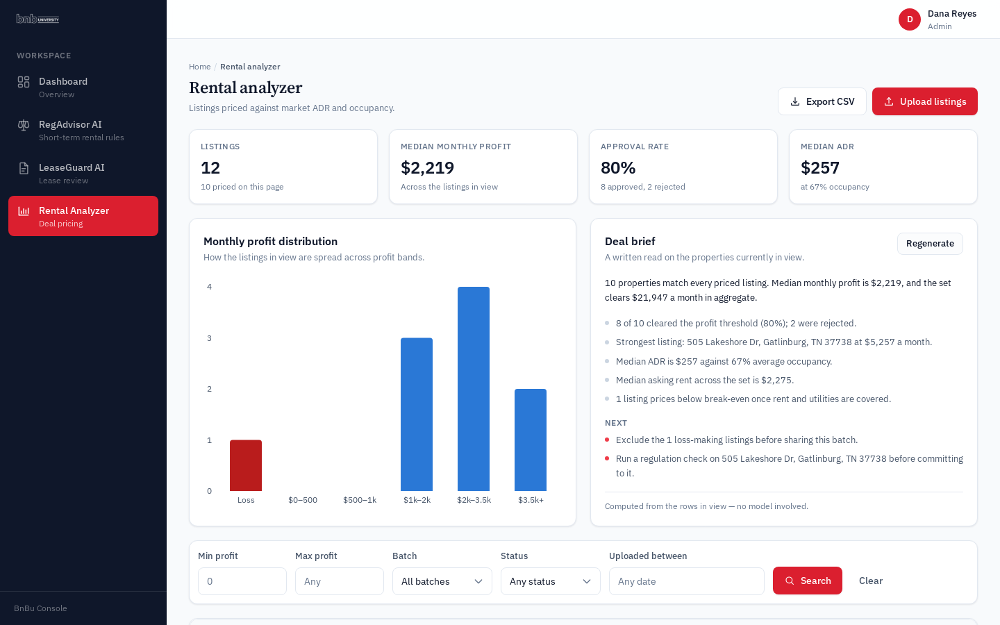

That is the rental analyzer. You upload a spreadsheet of candidate listings, the backend
prices each against market ADR and occupancy, and the page puts the batch in context: how
many cleared the profit threshold, how the profits are distributed, and a written read on
the rows in view. Every screenshot here is the Docker image running in demo mode, so the
data behind them is the seeded fixture set rather than somebody's database.

Two details there are deliberate: the loss bin is the only red bar *and* the only one
labelled "Loss", so meaning never rests on colour alone; and the brief's footer reads
`Computed from the rows in view — no model involved.` — no key is configured, and it works.

## Run it

```bash
docker compose up --build       # http://localhost:8140
```

Compose builds with `VITE_DEMO_MODE=true`, so the console boots populated — users, priced
listings, lease reviews, regulation searches — with no backend running and no seed step.
The login form is pre-filled and the demo transport accepts anything.

Against a real API instead:

```bash
VITE_DEMO_MODE=false VITE_API_URL=http://host.docker.internal:8000/ \
  docker compose up --build
```

Vite inlines `VITE_*` values at build time, so those are **build args**: an image is pinned
to whatever it was built with. The build stage is `node:22-bookworm-slim` (matching `.nvmrc`
and `engines`); the runtime stage is `nginx-unprivileged` as uid 101, with no build tooling
in it and a fallback to `index.html` so a refresh on a route does not 404.

Verified 2026-11-08 from a clean `git archive` of this repo: `docker compose build` succeeds,
the container reaches `Up (healthy)` on `0.0.0.0:8140->8080`, and `/`, `/healthz`,
`/rental-analyzer` and `/regulation/17/chat` all answer 200.

## What happens when you upload a lease

The lease path is the one worth drawing: two chained mutations, a cache invalidation that
replaces a pile of manual `refetch()` calls, and a poll that has to end on its own.

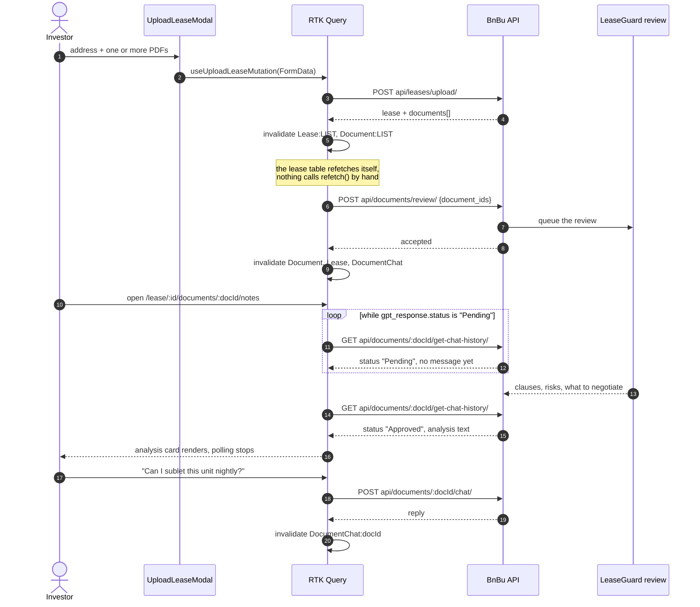
```mermaid
sequenceDiagram
    autonumber
    actor U as Investor
    participant M as UploadLeaseModal
    participant Q as RTK Query
    participant API as BnBu API
    participant AI as LeaseGuard review

    U->>M: address + one or more PDFs
    M->>Q: useUploadLeaseMutation(FormData)
    Q->>API: POST api/leases/upload/
    API-->>Q: lease + documents[]
    Q->>Q: invalidate Lease:LIST, Document:LIST
    Note over Q: the lease table refetches itself,<br/>nothing calls refetch() by hand

    Q->>API: POST api/documents/review/ {document_ids}
    API->>AI: queue the review
    API-->>Q: accepted
    Q->>Q: invalidate Document, Lease, DocumentChat

    U->>Q: open /lease/:id/documents/:docId/notes
    loop while gpt_response.status is "Pending"
        Q->>API: GET api/documents/:docId/get-chat-history/
        API-->>Q: status "Pending", no message yet
    end
    AI-->>API: clauses, risks, what to negotiate
    Q->>API: GET api/documents/:docId/get-chat-history/
    API-->>Q: status "Approved", analysis text
    Q-->>U: analysis card renders, polling stops

    U->>Q: "Can I sublet this unit nightly?"
    Q->>API: POST api/documents/:docId/chat/
    API-->>Q: reply
    Q->>Q: invalidate DocumentChat:docId
```

Kicking off the review is a second call, and a failure there leaves the lease uploaded but
unanalysed — `LeaseManagement.tsx` says so at the call site rather than pretending otherwise.

Review outcomes belong to the API. Editing a lease sends its five address fields and
nothing else: the edit dialog used to spread the whole cached lease into the `PUT`,
`status` included, so a dialog opened before a review finished could write the old status
back over the new one.

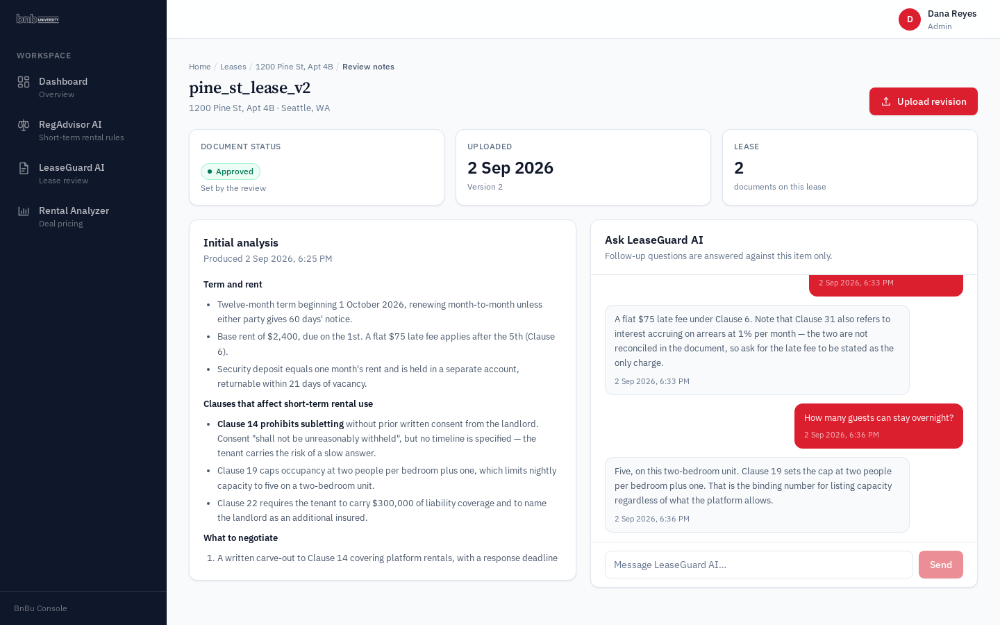

The result is that page: the one-off analysis on the left, a conversation scoped to the same
document on the right. One `ChatPanel` renders both the lease and the regulation
conversations — they differ only in endpoints and in what the assistant is called.

## How long it waits for an answer

An analysis takes minutes, and the only way to know it has landed is to ask. The rule the
code follows is that asking should get cheaper the longer the wait goes on, and should
stop entirely rather than run forever.

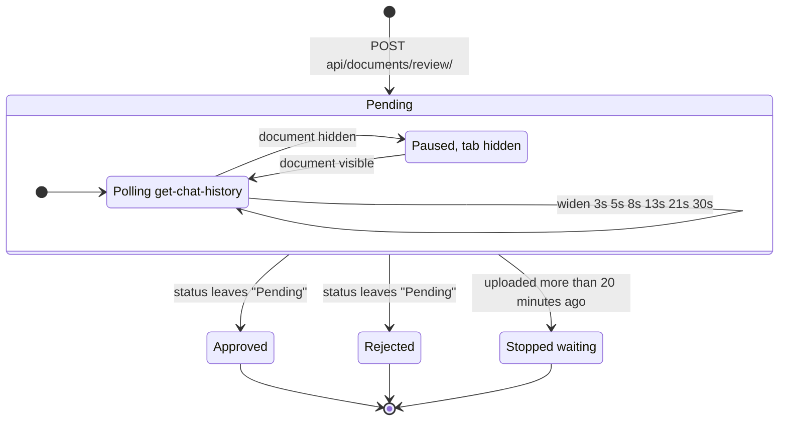
```mermaid
stateDiagram-v2
    [*] --> Pending : POST api/documents/review/

    state Pending {
        direction LR
        state "Polling get-chat-history" as Polling
        state "Paused, tab hidden" as Paused
        [*] --> Polling
        Polling --> Paused : document hidden
        Paused --> Polling : document visible
        Polling --> Polling : widen 3s 5s 8s 13s 21s 30s
    }

    Pending --> Approved : status leaves "Pending"
    Pending --> Rejected : status leaves "Pending"
    Pending --> Abandoned : uploaded more than 20 minutes ago

    state "Stopped waiting" as Abandoned

    Approved --> [*]
    Rejected --> [*]
    Abandoned --> [*]
```

`POLL_SCHEDULE_MS` in `hooks/useChatHistoryPolling.ts` is the ladder and `POLLS_PER_STAGE`
is 4, so a twenty-minute wait is `4 × (3+5+8+13+21) = 200s` of fast polling plus the
remaining ~1,000s at 30s: about 53 requests, against 400 for the flat
`setInterval(refetch, 3000)` the hook's comment records it replacing. The two regions above
are independent — a hidden tab sets the interval to zero while the backoff keeps widening.

The fetching is RTK Query's `pollingInterval` rather than a timer per component, so two
views of the same document share one poll. `DocumentChat` is a separate cache tag from
`Document` precisely so a poll tick does not drag the lease's document list along with it.

## Regulation searches

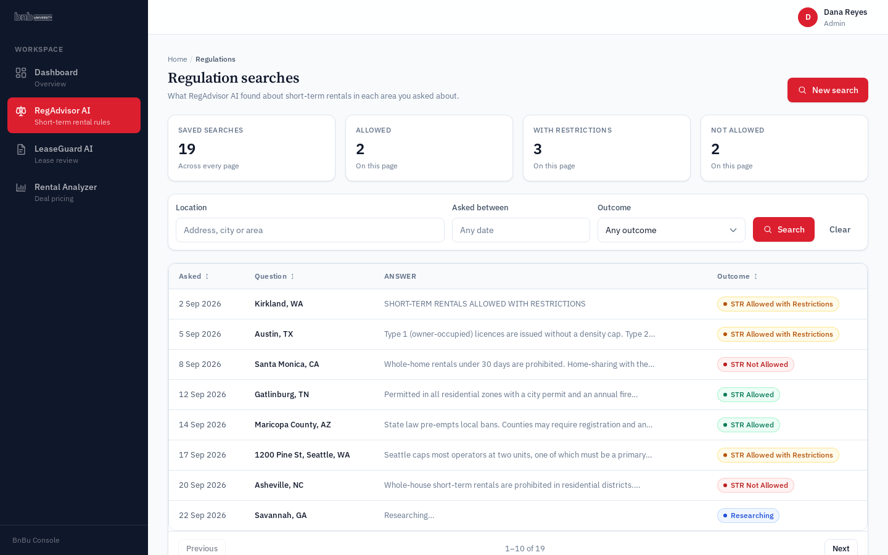

Ask whether a city permits short-term rentals, keep the answer, filter the pile later.

A search is answered one of two ways. If the API's curated rules table knows the place,
`POST api/regulations/` comes back `201` with the answer attached. Otherwise it comes back
`202` with `analysis_state: "pending"`, and a worker fills the row in later.
`POST api/regulations/:id/reanalyze/` — the **Look again** button on a search's page — is
routed the same way, and keeps the previous answer on the row until the new one lands.

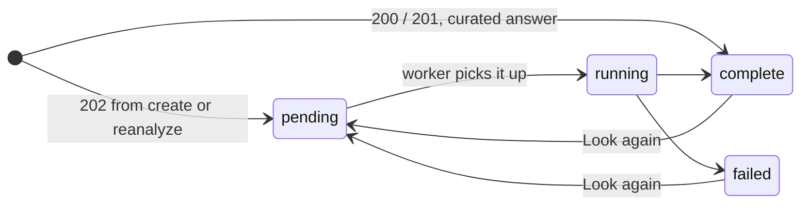
```mermaid
stateDiagram-v2
    direction LR
    [*] --> pending : 202 from create or reanalyze
    [*] --> complete : 200 / 201, curated answer
    pending --> running : worker picks it up
    running --> complete
    running --> failed
    failed --> pending : Look again
    complete --> pending : Look again
```

The console follows `analysis_state`, not the outcome column. While any row on the list,
or the one search being viewed, is `pending` or `running`, a second subscription to the same
RTK Query cache entry polls it (every 10 s on the list, 8 s on the search page, paused in a
hidden tab). The cache entry is shared, so the visible data refreshes, and the subscription
drops away as soon as nothing is owed. That replaced a poll keyed on `status === "pending"`,
which ran for as long as the page stayed open on a row the classifier could not label —
the API leaves those `pending` for good — and on every `STR Pending Approval` answer, which
is finished.

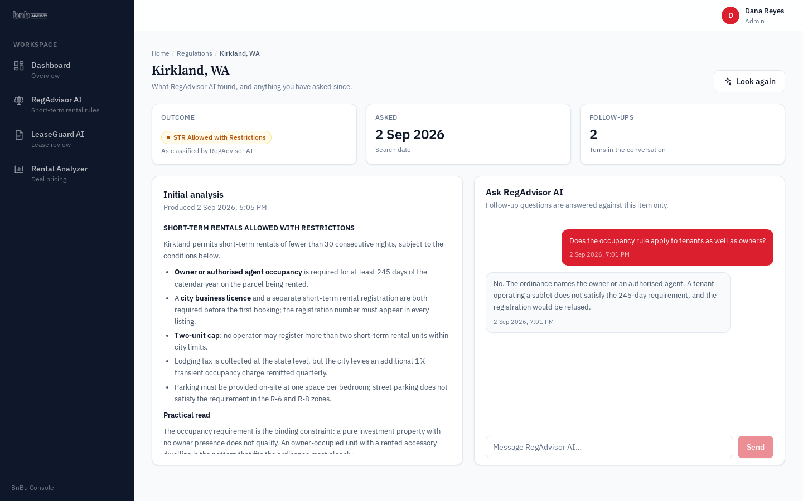

Two smaller things in that table are worth pointing at:

- The Savannah row reads **Researching**, not a grey `pending`. The Django model defaults to
  a lowercase `pending` — a different shape from the title-cased `STR Allowed` /
  `STR Not Allowed` values the rest of the column carries — so it reaches the UI as a status
  no badge had been written for. `ui/statusRegistry.ts` gives it an entry. Every
  status in the product — lease, document, regulation, rental — resolves through that
  registry, so adding one is a line of data rather than another `switch` in another
  component.
- The Kirkland preview reads `SHORT-TERM RENTALS ALLOWED WITH RESTRICTIONS`, not
  `**SHORT-TERM RENTALS ALLOWED WITH RESTRICTIONS**`. The stored answers are markdown, and
  `plainTextPreview()` in `lib/format.ts` strips the syntax for one-line previews — rendering
  markdown properly in a table cell would pull a 118 kB renderer onto a list route.

## Accounts

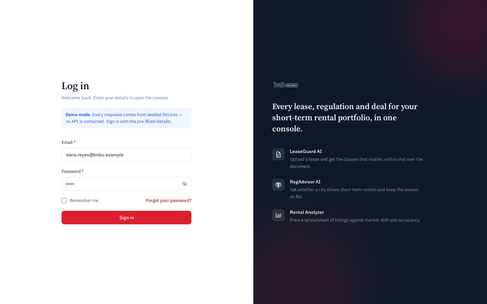

**Forgot your password?** on the login screen opens a dialog that posts the address to
`account/password/reset/`. The API answers `200` whether or not the address has an
account, so the dialog says the same thing either way — *if an account exists for that
address, a reset link is on its way* — and only a malformed address (`400`) reads
differently.

Accounts created by an admin start with `is_first_login` set. After signing in, the console
reads the profile, and such an account (admins excepted, as on the API side) is sent to
`/update-password/:id` before the dashboard. That page posts `new_password` and
`confirm_password` and shows Django's validator message when one fails ("This password is
too common."). It used to `PUT {password}`, a body the API never accepted.

"Remember me" stores the email address and nothing else. `Login.tsx` also calls
`localStorage.removeItem('password')` on mount, unconditionally — an older build of this
app wrote the user's plaintext password there, and this clears it out of existing browsers
on the next visit rather than leaving it readable by any script on the origin. Two tests in
`pages/__tests__/Login.test.tsx` pin the behaviour: *"never writes the password to
localStorage"* and *"prefills the remembered email and clears any legacy stored password"*.

## Uploads

The rental analyzer takes `.xlsx` and `.csv`. Legacy `.xls` is refused by the API, which
has no engine to read it, so the picker no longer offers it and says to re-save the
workbook as `.xlsx`. A file the picker refuses gets a line saying why instead of vanishing,
and when the API rejects an upload with a `400` (missing columns, say), its own message is
what the toast shows. Leases take PDFs only.

## One typed data layer

No component in `src/` calls `fetch`. Every call goes through an RTK Query hook whose
endpoint is declared in `services/endpoints/` and attached with `injectEndpoints`, and
`services/baseApi.ts` owns exactly three things: where the API is, how a request is
authenticated, and what the cache tags are. Dependencies point inward — `pages` →
`features`/`components` → `ui`/`lib` → `services` → `types`.

**Invalidation is declarative.** Nine tag types (`User`, `Profile`, `Lease`, `Document`,
`DocumentChat`, `Regulation`, `RegulationChat`, `RentalProperty`, `RentalTask`) replaced
three booleans on the auth slice that pages watched in order to call `refetch()` by hand.
A mutation now invalidates the tag it affects and unrelated tables are left alone, which
is what lets `keepUnusedDataFor` be 60 seconds instead of 0.

**Token refresh is single-flight.** `services/mutex.ts` is thirty lines of async mutex —
`baseQueryWithReauth` waits on it before every request, and on a 401 exactly one caller
rotates the refresh token while the others wait and retry. A dashboard firing six queries
at once against an expired token refreshes once, not six times, and the originals are
replayed transparently. If the refresh itself fails, `auth/sessionExpired` is dispatched and
the login screen explains why you are back there.

**Two transports, one set of endpoints.** `VITE_DEMO_MODE=true` swaps the base query for
one answering from `src/demo/fixtures.ts`; the endpoints, the tags and every component above
them are identical either way, which is what makes the screenshots here reproducible with no
backend. The fixtures sit behind a dynamic `import()`, so an ordinary build never fetches them.

## What ships

Measured from `npm run build` on 2026-11-08:

| Chunk | Raw | Gzip | When it loads |
| --- | --- | --- | --- |
| `index` (app shell + Login) | 61.5 kB | 19.3 kB | always |
| `vendor-react` (React 19, React Router 7, toasts) | 292.0 kB | 91.0 kB | always |
| `vendor-redux` | 86.2 kB | 29.3 kB | always |
| `vendor-charts` (Recharts 3) | 338.4 kB | 94.4 kB | the two charting routes |
| `vendor-forms` (formik, yup, datepicker, dropzone) | 268.2 kB | 74.3 kB | routes with forms |
| `vendor-markdown` | 117.8 kB | 35.5 kB | routes that render an analysis |

The critical path — the chunks `dist/index.html` loads or `modulepreload`s before anything
is clicked — is **441 kB raw / 140 kB gzip**. That is up from 322 kB / 106 kB under React 18,
and nearly all of the difference is `react-dom` 19; React Router 7 adds 15 kB, and Recharts 3
moved some shared Redux Toolkit code into `vendor-redux`. Every signed-in page is `lazy()`;
`Login` is the deliberate exception, being the entry point for every unauthenticated visit.
The whole `dist/` is 1.4 MB, images included.

The vendor split lives in `vite.config.ts` as Rolldown `codeSplitting` groups, and two
details there are load-bearing. Rolldown captures a group's dependencies along with it, so a
small shared package can drag a whole lazy group onto the critical path: `clsx` and
`react-toastify` (used by the shell) are claimed by `vendor-react`, and `lodash` (shared by
formik and Recharts) by the forms group, which outranks charts. And `ui/index.ts` does not
re-export `DateRangePicker` or `Dropzone`: the login screen imports that barrel, and the date
picker's stylesheet import is a side effect the bundler cannot drop, so listing them there
put both form libraries in the entry chunk. Nothing in the build complains when either goes
wrong — the critical path just grows — which is why both are explained where they live.

## Build-time configuration

Declared in `src/vite-env.d.ts`, which is the file to read if this table and the code ever
disagree. `.env.example` lists all of them; copy it to `.env.development` for `npm run dev`
or `.env.production` for a build.

| Variable | Default | What it does |
| --- | --- | --- |
| `VITE_API_URL` | `http://localhost:8000/` | Base URL of the BnBu API; must end in `/`. Unset logs a warning and uses the default, rather than resolving against the page origin and 404ing silently. |
| `VITE_DEMO_MODE` | `false` (`true` in Compose) | `'true'` answers every request from `src/demo/fixtures.ts`. No backend needed. |
| `VITE_AI_PROXY_URL` | unset | A proxy **you** deploy that talks to a language model for the Deal Brief. Unset means the brief falls back to its computed provider. |
| `VITE_AI_MODEL` | `claude-sonnet-4-5` | Model name passed through to that proxy. |
| `VITE_ENV` | unset | Declared for the deploy environments; `grep -r VITE_ENV src/` finds only the type declaration. Nothing branches on it. |

**Never put an API key in a `VITE_*` variable.** Vite inlines them into the shipped bundle
where anyone can read them. That constraint is the entire reason the Deal Brief goes
through a proxy: `providers/model.ts` holds no key and cannot.

That shapes the feature itself. `features/dealBrief/providers/` is an ordered array, each
provider declaring `isAvailable()`; the first available one wins and the heuristic provider
is the guaranteed tail, so resolution never returns undefined. If a configured model
provider throws, the brief falls back and the panel names whoever wrote it. It generates on
demand only — automatic generation would fire a call on every filter change and poll tick.

## Working on it

Node 22 (`.nvmrc`).

```bash
npm ci
npm run dev                        # :5173, expects the API on :8000
VITE_DEMO_MODE=true npm run dev    # …or no API at all

npm test          # vitest run — 27 files, 197 tests
npm run typecheck # tsc --noEmit
npm run lint      # eslint 10 flat config, --max-warnings 0
npm run build     # tsc && vite build
```

No test makes a network call or a paid API call; `fetch` is stubbed wherever an endpoint is
exercised, and the Deal Brief's model provider runs against a stubbed `fetch` too. The suite
pins the API contract the backend changed recently: the first-login body, the neutral reset
message, `.xls` refusal, `reanalyze` treated as a queued search, and the address-only lease
edit.

Screenshots are captured from the running container, so they cannot drift from the UI:

```bash
docker compose up -d --build
npx playwright install chromium    # once
npm run screenshots   # desktop 1440x900 and phone 390x844 → docs/screenshots/*.png
docker compose down -v
```

`SCREENSHOT_BASE_URL` points the script somewhere other than `http://localhost:8140`.

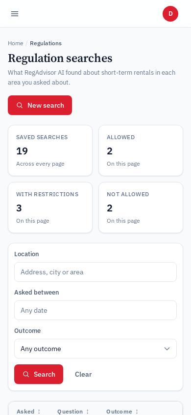

## A design system, not a component folder

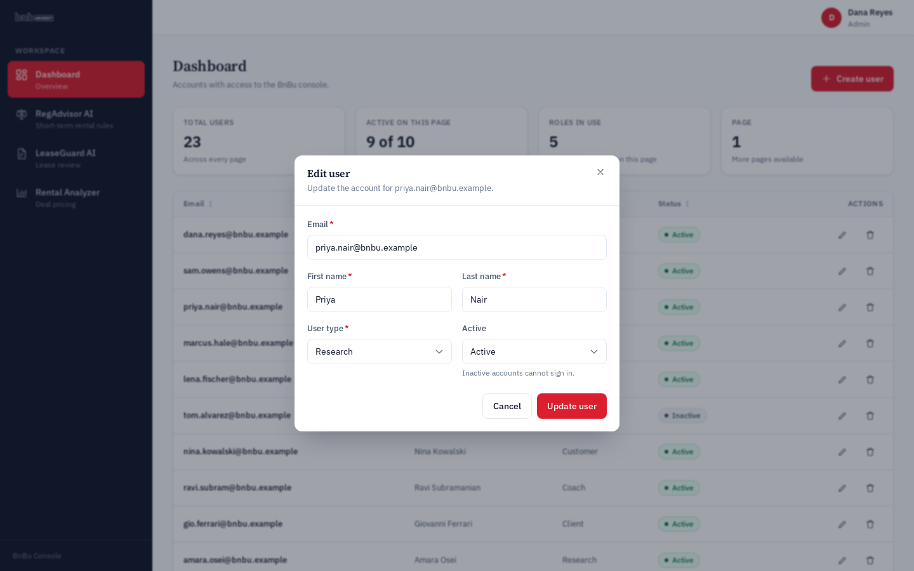

`src/ui/` is the only place that knows what the product looks like. That dialog is `Modal`
plus five `Field`s — label, control, required marker, error and description as one accessible
unit — over a `DataTable` with `StatusBadge` cells, `Pagination` below and `StatTile`s above.
Nothing in it is page-specific, which is why every table in the product looks like a sibling.

The type is IBM Plex Sans for the interface — its figures are even-width, which the money
and occupancy columns depend on — with page and dialog titles in Source Serif 4, closer to
the leases and ordinances the product reads than to a generic dashboard. The palette is the
BnBu crimson over slate, with semantic tones reserved for statuses. Below the `sm`
breakpoint the stat tiles sit two to a row, and below `md` the navigation becomes a drawer.

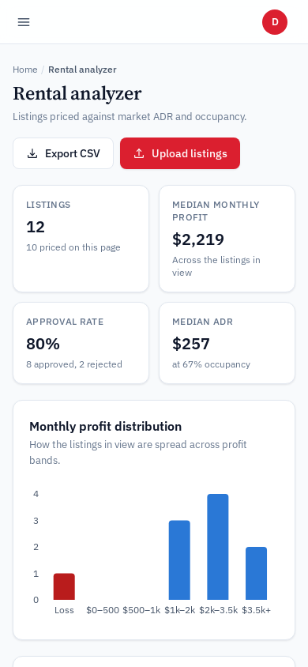

```
src/
├── ui/                  Design system: spacing, palette, focus rings, states
│   ├── DataTable.tsx    Sorting, empty/loading/error states, windows past 150 rows
│   ├── Field.tsx        Label + control + error + description, one unit
│   ├── statusRegistry.ts  Status vocabularies as data
│   └── charts/          Recharts wrappers sharing one theme
├── lib/format.ts        Currency, dates, occupancy, markdown-free previews
├── features/
│   ├── dealBrief/       Stats, provider registry, panel
│   └── chat/            The conversation UI, shared by leases and regulations
├── services/
│   ├── baseApi.ts       One RTK Query instance: auth, refresh mutex, cache tags
│   ├── endpoints/       One file per domain, attached via injectEndpoints
│   └── mutex.ts         Single-flight primitive for token refresh
├── store/               Redux store; auth + rentalTask slices
├── hooks/               useChatHistoryPolling (backoff), useDocumentVisible
├── demo/                Fixtures and a base query that serves them
├── pages/               Route components, all lazy except Login
└── components/          Domain components composed from ui/
```

`DataTable` windows its body past 150 rows, keeping the DOM flat when a batch upload returns
several thousand listings; below that it renders normally, because windowing a 20-row table
costs more than it saves.

## Known gaps

- **Nothing here is tested against the real API.** The suite runs entirely on fixtures and
  stubs, so a contract change in `bnbu_backend_api` would not fail a test in this repo — it
  would fail at runtime. A shared schema across the two repos is the honest fix.
- **The reset link has nowhere to land.** The API emails `/reset/<uid>/<token>/` but has no
  route that accepts the token and a new password, so this console has no page for it either.
- **Demo mode is a fixture server, not a simulator.** Its writes return success and change
  nothing (`handlers.ts` says as much), and its auth accepts any credentials.
- **The Deal Brief is not underwriting.** Medians, counts and a break-even check over the
  rows in view. It has no view on comparables, seasonality, financing or condition.
- **Tokens live in `localStorage`.** Readable by any script on the origin; the mitigation
  is that there are no third-party scripts on this page, which is a policy, not a control.
- **Recharts is 338 kB for two charts.** Lazy and split out, so it costs only the routes
  that use it, but a smaller library is the next real bundle win.
- **Token refresh assumes one tab.** Each tab holds its own in-memory mutex, so rotation is
  serialised within a tab and not across them. `BroadcastChannel` would close it.
- **Still on Tailwind 3.** Tailwind 4 moves configuration into CSS and is a migration of its
  own.
- **en-US and USD, hard-coded** in `lib/format.ts`. No i18n, no currency handling.
- **Accessibility is improved but unaudited.** Consistent focus states, labelled fields and
  dialog semantics come from `ui/`, but there has been no screen-reader pass.

## License

MIT — see `LICENSE`.
